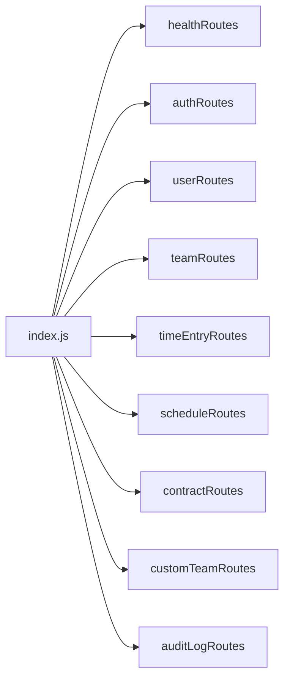
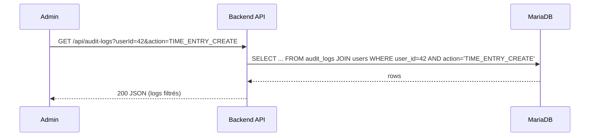

# Rapport technique backend – Time‑Manager

## 1. Contexte et objectifs

Time‑Manager est une application de suivi du temps pour un contexte bancaire, avec des exigences fortes de :
- **Suivi du temps** (pointages, heures travaillées, retards)
- **Conformité RH / légale** (audit, traçabilité)
- **Sécurité** (LDAP, rôles, RGPD)

Au départ :
- **Backend** : Node.js + Express, un seul fichier `index.js`
  - Uniquement un endpoint `POST /auth/login` pour authentification LDAP + émission de JWT
  - Aucune connexion à la base MariaDB (malgré la présence du service `db` dans `compose.yml`)
- **Frontend** : React monolithique (`main.jsx`), toute la logique métier et la “BD” dans `localStorage`
- **Docker** : stack avec `db` (MariaDB), `backend`, `frontend`, `reverse-proxy` (Nginx), `mailpit`

**Objectif de notre travail backend** :
1. **Intégrer la base MariaDB** comme source de vérité pour les données métier
2. **Modéliser les entités** (users, teams, time_entries, schedules, contracts, custom_teams, audit_logs)
3. **Créer des APIs REST** sécurisées (/api/*) pour remplacer progressivement `localStorage` côté frontend
4. **Ajouter un système d’audit** (who/what/when) pour les actions sensibles
5. **Réorganiser le backend** en modules clairs (routes, middleware, DB)

---

## 2. Schéma de données mis en place

### 2.1 Vue d’ensemble (ERD)

```mermaid
erDiagram
  users ||--o{ user_roles : has
  roles ||--o{ user_roles : has

  users }o--o{ teams : "belongs to (team_id)"

  users ||--o{ time_entries : has
  teams ||--o{ time_entries : has

  users ||--|| schedules : has
  users ||--|| contracts : has

  custom_teams ||--o{ custom_team_members : has
  users ||--o{ custom_team_members : member

  users ||--o{ audit_logs : "actor (user_id)"

  users {
    bigint id PK
    varchar username
    varchar display_name
    varchar email
    varchar ldap_dn
    bigint team_id FK -> teams.id
    tinyint is_active
    datetime deleted_at
    datetime created_at
    datetime updated_at
  }

  roles {
    bigint id PK
    varchar name
    varchar description
  }

  user_roles {
    bigint user_id FK -> users.id
    bigint role_id FK -> roles.id
  }

  teams {
    bigint id PK
    varchar name
    enum type  "LDAP|INTERNAL"
    varchar ldap_dn
    datetime created_at
    datetime updated_at
  }

  custom_teams {
    bigint id PK
    varchar name
    bigint created_by_user_id FK -> users.id
    datetime created_at
    datetime updated_at
  }

  custom_team_members {
    bigint custom_team_id FK -> custom_teams.id
    bigint user_id FK -> users.id
  }

  time_entries {
    bigint id PK
    bigint user_id FK -> users.id
    bigint team_id FK -> teams.id
    datetime start_time
    datetime end_time
    enum source "MANUAL|AUTO|SEEDED"
    varchar comment
    datetime created_at
    datetime updated_at
  }

  schedules {
    bigint id PK
    bigint user_id FK -> users.id (UNIQUE)
    varchar am_start
    varchar am_end
    varchar pm_start
    varchar pm_end
    datetime created_at
    datetime updated_at
  }

  contracts {
    bigint id PK
    bigint user_id FK -> users.id (UNIQUE)
    enum type "CDI|CDD|STAGE|OTHER"
    date start_date
    date end_date
    datetime created_at
    datetime updated_at
  }

  audit_logs {
    bigint id PK
    bigint user_id FK -> users.id
    varchar action
    varchar entity_type
    bigint entity_id
    json metadata
    varchar ip_address
    datetime created_at
  }
```

### 2.2 Script SQL

Tous ces modèles sont définis dans `backend/sql/schema.sql`, avec :
- **Création des tables** (`CREATE TABLE IF NOT EXISTS …`)
- **Clés étrangères** (FK) + `ON DELETE CASCADE` ou `SET NULL` selon le cas
- **Index** utiles (ex : `idx_time_entries_user`, `idx_audit_user`, etc.)
- **Données initiales** dans `roles` (`ROLE_EMPLOYEE`, `ROLE_MANAGER`, `ROLE_ADMIN`)

Ce script est exécuté une fois au démarrage (via `TEST.md` / commandes Docker ou MySQL).

---

## 3. Connexion DB & scripts de test

### 3.1 Connexion DB (mysql2)

Fichier `src/db.js` :
- Utilise `mysql2/promise` avec un **pool de connexions**
- Lit la config via env (`DB_HOST`, `DB_PORT`, `DB_NAME`, `DB_USER`, `DB_PASS`)
- Expose :
  - `query(sql, params)`
  - `queryOne(sql, params)`
  - `getPool()`
  - `close()`

```mermaid
flowchart LR
  App[Express routes] --> DBModule[db.js\n(mysql2 pool)]
  DBModule -->|query/queryOne| MariaDB[(MariaDB)]
```

### 3.2 Script de test DB

Fichiers :
- `test-db.js` : script Node pour tester la connexion + lister les tables
- `TEST.md` : guide pratique (Docker + commandes PowerShell/Bash) :
  - `docker-compose up db -d`
  - Exécution de `sql/schema.sql`
  - `docker-compose exec backend npm run test:db`

Ce test vérifie :
- Connexion OK
- Tables présentes
- Aucun crash au niveau du client MySQL.

---

## 4. Sécurité & authentification

### 4.1 Auth LDAP + JWT

Fichier `src/routes/auth.js` :
- Endpoint `POST /auth/login` :
  - Normalise le `username` (DOMAINE\user, user@domain, user)
  - Se connecte à l’AD via **LDAP** (`ldapjs`) :
    - Soit en **direct bind UPN** (`user@UPN_DOMAIN`)
    - Soit via **compte de service** (`LDAP_BIND_DN` puis re‑bind user)
  - Récupère :
    - DN, `memberOf`, `displayName`
    - Liste des équipes (OUs) et utilisateurs LDAP (si rôle Admin/Manager)
  - Mappe les groupes AD → rôles applicatifs :
    - `GG_TM_Admins` → `ROLE_ADMIN`
    - `GG_TM_Managers` → `ROLE_MANAGER`
    - `GG_TM_Employees` → `ROLE_EMPLOYEE`
  - Émet un **JWT** avec :
    - `sub`: `normalizedUsername`
    - `roles`: `["ROLE_…"]`
    - TTL : `JWT_TTL_MINUTES`
  - Réponse :
    - `{ token, roles, username, displayName, team, teams, users }`

### 4.2 Middleware JWT + rôles

Fichier `src/middleware/auth.js` :
- `authenticateJWT` :
  - Lit `Authorization: Bearer <token>`
  - Vérifie le token via `jwt.verify` et `JWT_SECRET`
  - Injecte `req.user = { username, roles }`

- `authorizeRoles(...allowedRoles)` :
  - Vérifie que `req.user.roles` contient au moins un rôle autorisé
  - Retourne `403` sinon.

### 4.3 Routes d’auth de haut niveau

Dans `routes/auth.js` :
- `GET /api/me` : renvoie `{ username, roles }` à partir du JWT
- `GET /api/admin/ping` : route test accessible uniquement à `ROLE_ADMIN`

---

## 5. Organisation du code (refactor d’index.js)

Avant : tout était dans `src/index.js` (LDAP, routes, logique métier, etc.).  
Après refactor, `src/index.js` est minimal :



`index.js` :
- Configure Express (`json`, `cors`, `helmet`)
- Monte les routes :
  - sans préfixe : `healthRoutes`, `authRoutes`
  - préfixées `/api` : `users`, `teams`, `timeEntries`, `schedules`, `contracts`, `customTeams`, `auditLogs`

Chaque domaine métier a son fichier dans `src/routes/`.

---

## 6. Routes métier implémentées

L’ensemble des routes est documenté dans `backend/ROUTES.md`.  
Résumé par domaine :

### 6.1 Health & DB
- `GET /health` : ping simple
- `GET /test/db` : test connexion + liste tables

### 6.2 Auth & profil
- `POST /auth/login` : login LDAP + JWT
- `GET /api/me` : infos du user courant (JWT)
- `GET /api/admin/ping` : test rôle admin

### 6.3 Users
- `GET /api/users` : liste des users (Admin/Manager)
- `GET /api/users/:id` : détail user
- `PATCH /api/users/:id` : MAJ partielle (`displayName`, `email`, `teamId`, `isActive`)

### 6.4 Teams
- `GET /api/teams` : liste des équipes (LDAP + internes)

### 6.5 Time entries (clocks)
- `GET /api/time-entries` : liste filtrable par `userId`, `teamId`, `from`, `to`
- `POST /api/time-entries` : créer un pointage (`userId`, `startTime`, etc.)
- `PATCH /api/time-entries/:id` : MAJ `endTime`, `comment` (Admin/Manager)
- `DELETE /api/time-entries/:id` : suppression (Admin)

### 6.6 Schedules (horaires)
- `GET /api/users/:id/schedule` : lire l’horaire d’un user (Admin/Manager)
- `PUT /api/users/:id/schedule` : créer/MAJ (UPSERT) les horaires `am_start`, `am_end`, `pm_start`, `pm_end`

### 6.7 Contracts
- `GET /api/users/:id/contract` : type de contrat + dates (Admin/Manager)
- `PUT /api/users/:id/contract` : créer/MAJ contrat (`type`, `startDate`, `endDate`)

### 6.8 Custom Teams
- `GET /api/custom-teams` : liste (sans membres)
- `GET /api/custom-teams/:id` : détail + membres
- `POST /api/custom-teams` : créer (avec `name` + `memberIds` optionnels)
- `PATCH /api/custom-teams/:id` : renommer
- `DELETE /api/custom-teams/:id` : supprimer
- `POST /api/custom-teams/:id/members` : remplacer liste de membres
- `DELETE /api/custom-teams/:id/members/:userId` : retirer un membre

---

## 7. Système d’audit

### 7.1 Middleware `audit`

Fichier `src/middleware/audit.js` :
- `resolveUserId(username)` : mappe `username` → `users.id`
- `logAudit(req, { action, entityType, entityId, metadata })` :
  - Résout `userId` (ou `null` si inconnu)
  - Récupère l’adresse IP (`x-forwarded-for` ou `req.ip`)
  - Insère dans `audit_logs` :
    - `user_id`, `action`, `entity_type`, `entity_id`, `metadata` (JSON), `ip_address`
  - Ne casse jamais la requête si l’insertion échoue (log console uniquement).

### 7.2 Actions auditées

#### Time entries

Dans `routes/timeEntries.js` :
- `TIME_ENTRY_CREATE` sur `POST /api/time-entries`
  - Métadonnées : `userId`, `teamId`, `startTime`, `endTime`
- `TIME_ENTRY_UPDATE` sur `PATCH /api/time-entries/:id`
  - Métadonnées : `endTime`, `comment`
- `TIME_ENTRY_DELETE` sur `DELETE /api/time-entries/:id`
  - Snapshot avant suppression (`userId`, `teamId`, `startTime`, `endTime`)

#### Custom teams

Dans `routes/customTeams.js` :
- `CUSTOM_TEAM_CREATE`
  - Métadonnées : `name`, `memberIds`
- `CUSTOM_TEAM_UPDATE` (rename)
  - Métadonnées : `name`
- `CUSTOM_TEAM_DELETE`
  - Métadonnées : équipe + membres avant suppression
- `CUSTOM_TEAM_SET_MEMBERS`
  - Métadonnées : nouvelle liste `memberIds`
- `CUSTOM_TEAM_REMOVE_MEMBER`
  - Métadonnées : `userId` retiré

### 7.3 Lecture des logs

Fichier `routes/auditLogs.js` :
- `GET /api/audit-logs` (Admin uniquement)
  - Filtres :
    - `userId`, `action`, `entityType`, `from`, `to`, `limit`
  - Résultat :
    - `id, userId, username, action, entityType, entityId, metadata (JSON parsé si possible), ipAddress, createdAt`



---

## 8. Résumé et prochaines étapes

### 8.1 Ce qui est fait

- Schéma de données complet en MariaDB (ACID, FK, index)
- Connexion DB robuste via `mysql2` + scripts de test (`test-db.js`, `TEST.md`)
- Auth LDAP + JWT + RBAC (roles AD → rôles applicatifs)
- Architecture backend modulaire (routes par domaine, middleware partagés)
- APIs REST backend couvrant :
  - Users, Teams, Custom Teams
  - Time Entries (clocks)
  - Schedules (horaires)
  - Contracts (contrats)
  - Audit Logs
- Système d’audit pour les actions sensibles (clocks & custom teams)

### 8.2 Prochaines étapes possibles

1. **Brancher le frontend** sur ces APIs (remplacer `localStorage` petit à petit)
2. **Étendre l’audit** à d’autres opérations (updates Users, Schedules, Contracts, etc.)
3. **Rapports/KPIs** backend (endpoints `/api/reports/*` pour retards, heures sup, présence)
4. **Tests automatiques** (Jest + supertest) pour les routes critiques
5. **Hardening** :
   - Gestion fine des erreurs LDAP & DB
   - Logs structurés (JSON) + corrélation
   - Vérification RGPD (export/suppression de données par user)

Ce rapport résume l’ensemble des travaux réalisés côté backend et sert de référence pour la suite (intégration frontend, tests, mise en production). 
*** End Patch
```} ***!
*** End Patch  अंदर-JSON placeholder***】` सोच`】`"} ***!
*** End Patch***} ***!
*** End Patch***
```} !***} ***!
